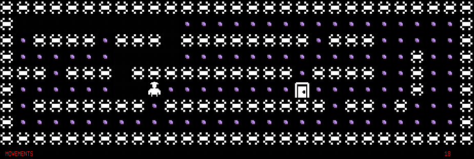
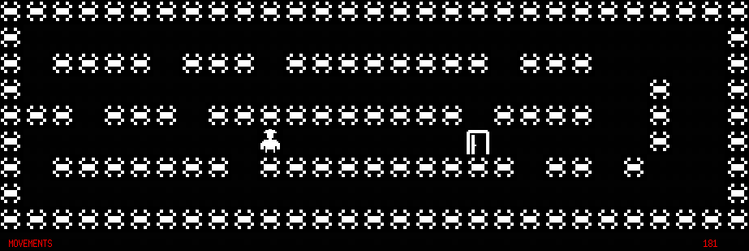

# Project so_long - 42Cursus

This is the "so_long" project of 42Cursus, which involves creating a 2D game in C using the minilibx graphic library.

## Objective

The objective of the project is to create a simple 2D game using the minilibx graphic library. The player must move through a map, collect items, reach a goal while avoiding obstacles and enemies.

## Requirements

- Any operating system (this project was tested on macOS and Linux).
- `gcc` (or a C-compatible compiler).
- [Minilibx](https://github.com/42Paris/minilibx-linux) - Make sure to follow the installation instructions for minilibx on your operating system.

## Installation

1. Clone this repository on your local machine:

```bash
git clone <repository_URL>
```

2. Navigate to the project directory:

```bash
cd so_long
```

3. Compile the project:
```bash
make
```

## Usage

To run the game, use the following command:
```
./so_long maps/map.ber
```

Replace `maps/map.ber` with the location of the map file that you want to try.

## Controls

- W: Move Up.
- A: Move Left.
- S: Move Down.
- D: Move Right.
- ESC: Exit the game.

## Game Rules

- The player must collect all items ('C') before reaching the exit ('E').

## Preview




## Additional Resources

- [Minilibx Documentation](https://github.com/42Paris/minilibx-linux)
- [Minilibx Tutorial](https://harm-smits.github.io/42docs/libs/minilibx/getting_started.html)

## Credits

This project was completed as part of the 42Cursus curriculum at [42](https://www.42madrid.com/).